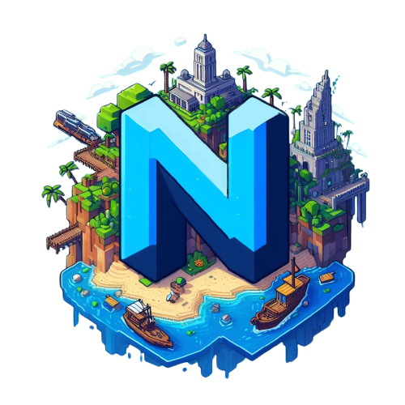

# ⚒️ Wiki


Das Wiki befindet sich aktuell noch im Aufbau und ist daher noch nicht vollständig.


<figure><figcaption></figcaption></figure>

## Über Nexous

Nexous ist ein deutsches Minecraft-Netzwerk, das am 15.11.2020 gegründet wurde und sowohl Java 1.21 als auch Minecraft Bedrock unterstützt. Bei uns erwartet dich ein erstklassiger CityBuild, der regelmäßig mit Updates erweitert wird.

## Informationen&#x20;

Dieses Wiki bietet eine Übersicht über die Besonderheiten des Servers sowie wichtige Links zum Server und unseren sozialen Medien. Bei offenen Fragen kannst du unser Support-Team auf Discord kontaktieren.
