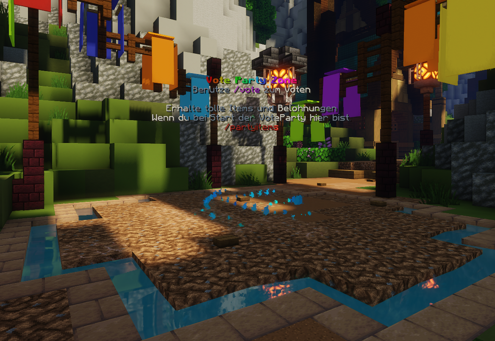

# 💎 Vote


Diese Seite befindet sich aktuell noch im Aufbau 


## Vote Links

Nutze die folgenden Links, um für unseren Server abzustimmen und Vote-Tokens zu sammeln. Gib einfach deinen Spielernamen auf der Seite ein und klicke auf „Vote“.


Vote-Link 1



Vote-Link 2


## Vote Party

Die Vote-Party beginnt, sobald 50 Votes erreicht wurden. Sobald dieses Ziel erreicht ist, erscheint eine Chat-Nachricht, und du kannst dich in die sogenannte Vote-Party-Zone teleportieren. Wer sich in dieser Zone aufhält, erhält bei Start der Party Belohnungen aus dem `/partyitems`-Menü sowie Geld und Vote-Crate-Keys.

<figure><figcaption></figcaption></figure>


Du kommst zur Vote Party Zone mit dem Befehl `/warp tp VoteParty`


## Vote Shop
